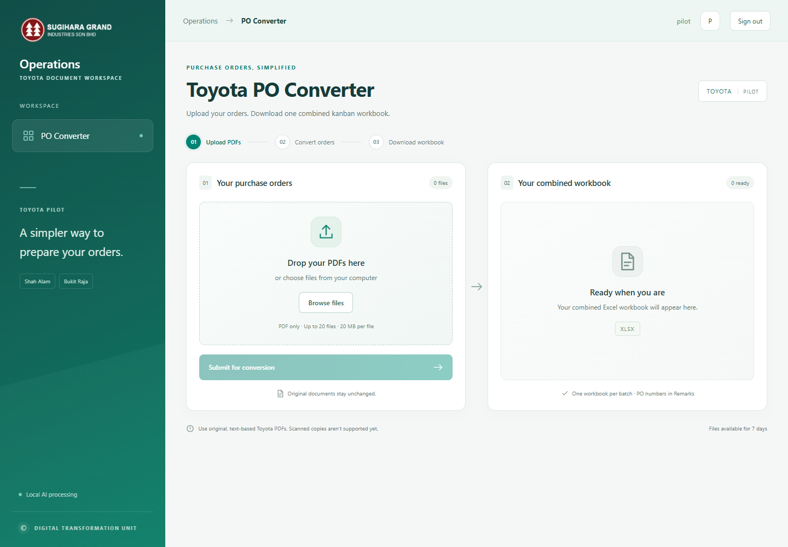

# Toyota PO Converter

An internal Toyota order converter: upload PDF purchase orders, extract them with local Ollama through n8n, and download one combined kanban workbook for the entire batch.

The interface uses a compact Sugihara Grand Industries logo, Digital Transformation Unit branding, and the original green/teal palette with a subtle animated gradient. The header and desktop sidebar stay fixed while content scrolls. Animation respects reduced-motion preferences. PO numbers go in Remarks beside their trip: `SGIS12AA0747-SA` for Shah Alam and `SGIS13FA5002-BR` for Bukit Raja. Original order IDs are retained separately for source validation. Orders for the same delivery date share one sheet; batches with multiple dates have one daily sheet per date within the same workbook.



## Deploy on the AI Atom PC

Repository: https://github.com/digitalsgisb/logistic_PO_n8n

Prerequisites: Docker Engine with Compose, an existing n8n container, and the existing Ollama model `glm-4.7-flash:q8_0`. The application does not replace or upgrade either existing service.

```bash
git clone https://github.com/digitalsgisb/logistic_PO_n8n.git
cd logistic_PO_n8n
```

Create `.env` from `.env.example`. Generate three different secrets: a pilot password of at least 12 characters, and session/service secrets of at least 32 characters. If Node 24 is installed, `npm ci && npm run setup` generates this file without printing secrets or overwriting an existing file. With Docker only:

```bash
docker run --rm --user "$(id -u):$(id -g)" -v "$PWD:/work" -w /work node:24.12.0-bookworm-slim node scripts/setup.ts
```

Edit `.env` locally. Set:

| Setting           | Value                                                                                                      |
| ----------------- | ---------------------------------------------------------------------------------------------------------- |
| `N8N_NETWORK`     | Existing n8n Docker network, shown by `docker network ls`                                                  |
| `N8N_WEBHOOK_URL` | Production webhook, usually `http://n8n:5678/webhook/toyota-po`; use the existing container's service name |
| `BIND_IP`         | `127.0.0.1` for the local tunnel origin; use `100.109.37.96` only when direct Tailscale access is required |
| `WEB_PORT`        | `3500`                                                                                                  |
| `PILOT_USERNAME`  | Shared pilot account name, default `pilot`                                                                 |
| `COOKIE_SECURE`   | `false` for HTTP over Tailscale; `true` behind HTTPS                                                       |

Do not put `.env` into Git. The repository ignores credentials, runtime storage, generated outputs, and the supplied original business documents.

### Import and connect n8n

1. Import `workflows/toyota-po-converter.json` as a **new** workflow.
2. Create an **HTTP Header Auth** credential named **Toyota Internal API**. Header name: `X-Service-Secret`. Header value: the exact `SERVICE_SECRET` from `.env`.
3. Select that credential in **Toyota Job Webhook**, **Claim Next Page**, and **Save Page Result**.
4. Select your existing Ollama credential in **Ollama Chat Model**. Confirm `glm-4.7-flash:q8_0` is available.
5. The two backend HTTP nodes use `http://toyota-api:3000`. Compose adds that alias to the selected n8n network. No backend public port is needed.
6. Publish/activate the workflow. Use its production webhook, not the test webhook, in `.env`.

The workflow performs one extraction at a time. It retries failed extraction once, then reports the error and continues. The application validates results and generates workbooks. n8n's successful execution data is not retained; configure normal n8n execution pruning for failed executions as appropriate for your instance.

```bash
docker compose config --quiet
docker compose up -d --build
docker compose ps
docker compose logs --tail=80 api
```

Open **http://127.0.0.1:3500** on the server, or use the hostname configured in your tunnel, and sign in with the account from `.env`. Upload the sample PDF and verify one downloadable workbook containing four orders and nine item lines.

### Existing deployment: switch to localhost:3500

Pull the update and edit the existing `.env` on the server. Preserve its credentials and n8n settings; change only:

```dotenv
BIND_IP=127.0.0.1
WEB_PORT=3500
```

Apply the new port mapping:

```bash
docker compose up -d --no-deps web
curl -I http://127.0.0.1:3500
```

Set the `logistic.sugidigital.org` tunnel route to service type **HTTP** and URL **localhost:3500**. The connector must share the server's network namespace for this localhost address to work. This replaces the app's old port 8088 mapping; other tunnel routes retain their own service settings. Existing `.env` files override Compose defaults, so pulling the repository alone does not change a deployed port.

### Updates and persistent data

```bash
git pull --ff-only
docker compose up -d --build
```

Jobs, original uploads, extracted values, and outputs are stored in the `toyota-data` volume. Back up that volume if required. Do not use `docker compose down -v` when keeping jobs. New application versions preserve the volume; interrupted work is marked retryable after restart. Files and job records expire after seven days by default.

For the combined-output update, keep your working `.env`, Compose networking changes, and n8n workflow URLs. Only the application needs rebuilding. Completed jobs keep their existing downloads; choose **Start new batch** and upload the PDFs again to get the new combined layout. Retried partial jobs rebuild a single workbook from all valid orders.

## Local development

Requires Node 24.12 or later. SQLite uses Node's built-in driver; its experimental warning on Node 24.12 is expected.

```bash
npm ci
npm run setup
```

Set a reachable `N8N_WEBHOOK_URL` in `.env`. Set `HOST=127.0.0.1` for local development. In two terminals:

```bash
node --env-file=.env --import tsx server/index.ts
npm run dev:web
```

Open http://127.0.0.1:5173. If n8n runs on another computer, its two HTTP nodes must point at a reachable address for this development backend, and the backend must bind to that network interface. Production Compose uses internal service names instead.

## Validation

```bash
npm test
npm run build
```

Tests generate synthetic text PDFs and cover authentication, uploads, duplicate file detection, PDF overlay deduplication, source-grounded validation, multi-page orders, partial failures, restart/retry, stale callbacks, Excel cells, and ZIP downloads. They do not require your source PDF or an AI server.

To test the original sample with the real AI model, place `TOYOTA PO.pdf` in the root (ignored by Git), or set `SAMPLE_PDF` to its path:

```bash
OLLAMA_URL=http://100.109.37.96:11434 npm run sample -- --live
```

Outputs go to `outputs/combined-live-sample/`. Without `--live`, the sample script uses known fixture extraction values in `outputs/combined-fixture-sample/`; that mode tests mapping and rendering, not AI accuracy.

## Mapping and template

- The template is `templates/toyota.xlsx`, containing only `ASSB2016`.
- Item-code headers map deterministically to columns D–AD. Bukit Raja occupies D–U and Shah Alam V–AD.
- Trip quantity rows begin at 13 and repeat every three rows. `WS02-NN` and `WM02-NN` support trips 1–10. HU83 uses `WS02-01` even when `PA1-10` is also printed.
- `QTY` uses total pieces. Orders sharing a delivery date, trip, and item code are added into that quantity cell; conflicting part numbers require review.
- Suffixed PO numbers appear once per order in column AE (Remarks), within that trip's three rows. Wrapped Remarks rows expand when needed. KB NO, DO.NO, ETA, and outstanding cells remain blank.
- The header date comes from the source. Each date gets a daily template sheet in the same workbook. A single-date batch retains the `ASSB2016` sheet name.
- Repeated order pages are deduplicated; missing pages and conflicting versions require review. Source orders remain separate in extraction records. Within one order, repeated matching items are summed only when part and pack details agree.
- Matching source identifiers and numeric values is mandatory. Unknown destinations/codes/routes, ambiguous dates, missing items, and quantity discrepancies do not produce a ready workbook.

### Rebuilding the legacy template

The original `.xls` is deliberately not committed because it contains unrelated customer sheets. Put it at `templates/source.xls` locally, install LibreOffice, then run:

```bash
npm run prepare:template -- templates/source.xls
```

This converts with LibreOffice, retains `ASSB2016`, clears example values, and corrects the repeated Trip 4 label to Trip 5. Visually review the output before replacing the deployed template. `SOFFICE_PATH` can select a non-default LibreOffice executable.

The initial bundled template was prepared from the source BIFF cells, styles, dimensions, and merges using `scripts/extract-xls.py` because LibreOffice was unavailable on the development computer. That fallback sets an A3 landscape print area of A4:AE42; it is not represented as a LibreOffice-verified conversion. The normal regeneration route above uses LibreOffice and retains its converted print settings.

## Pilot limits and troubleshooting

- Only text-based PDFs are supported. Scanned and password-protected PDFs need an original/unlocked copy.
- Defaults: 20 files, 20 MB each, 100 MB per batch, and 100 pages per file. When increasing the batch limit, also increase Nginx's `client_max_body_size` in `deploy/nginx.conf`.
- Partial batches offer one workbook of valid orders alongside review errors. Retry only reprocesses unsuccessful pages, then rebuilds the combined workbook from all valid orders without double-counting.
- “Unable to start processing”: verify the workflow is published, network/service names resolve, and the service secret matches.
- “No response from processing”: inspect n8n execution logs; fix the model/connection issue, then retry. The timeout defaults to 15 minutes without page progress.
- A review error caused by incorrect source data requires a corrected upload; the pilot does not include an in-browser editor.
- This pilot does not update monitoring workbooks, Microsoft 365, or other customers' records.

See `docs/verification.md` for the implementation's recorded checks and deployment limitations.
